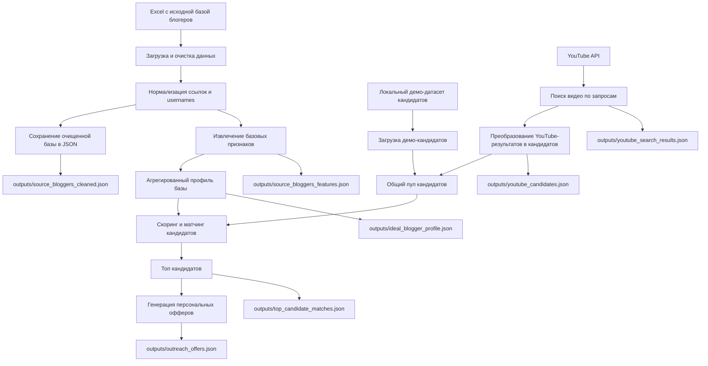

# Схема автоматизации

Ниже приведена схема текущего MVP-конвейера для `Части 1`.

## Пояснение по шагам

1. Скрипт читает Excel-файл с исходной базой блогеров.
2. Данные очищаются: извлекаются ссылки, usernames и проблемные строки.
3. По исходной базе строится упрощенный профиль подходящего блогера.
4. Кандидаты берутся из двух источников:
   - локальный демо-датасет;
   - живой поиск через YouTube API.
5. Все кандидаты приводятся к единому формату.
6. Для каждого кандидата считается score по темам, визуальным тегам, tone of voice и источнику.
7. Выбирается топ кандидатов.
8. Для выбранных кандидатов генерируются персональные черновики офферов.

## Ограничения текущей версии

- Instagram и Telegram пока не подключены как живые источники поиска.
- Портрет исходной базы пока строится на упрощенных признаках, а не на полном анализе контента профилей.
- Офферы собираются по шаблонной логике, без прямого вызова LLM API.
