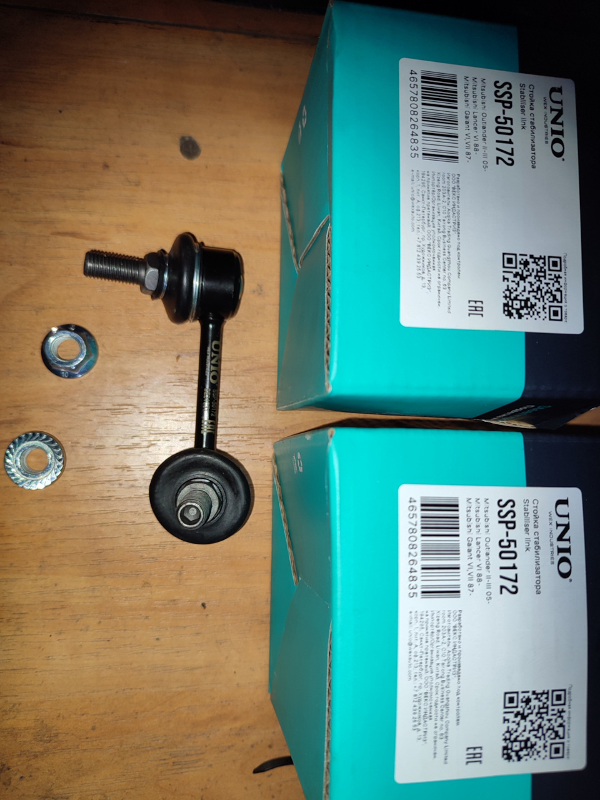
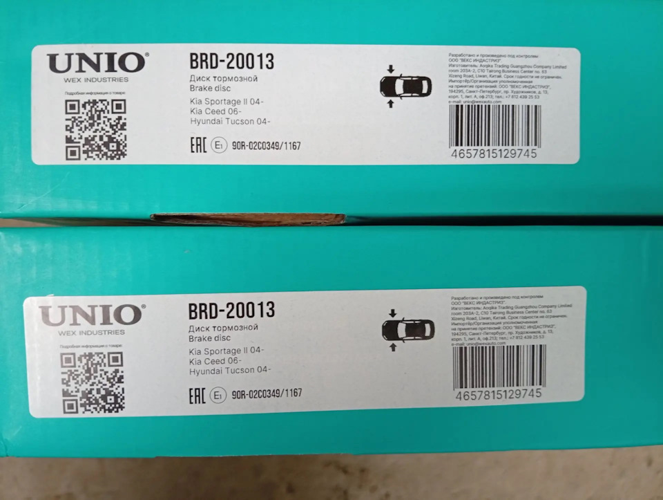

# Часть 3. Прошлые проекты

Ниже собраны 3 проекта, которые лучше всего показывают мой опыт в разработке и автоматизации процессов.

## 1. Внутренняя система медицинского центра

**Ссылка:** [Med_center_public](https://github.com/Natalia-Epifanova/Med_center_public)

### Что это и какую задачу решало

Это внутренняя система медицинского центра для администраторов и медицинского персонала. Проект решал задачу объединения в одном приложении ключевых рабочих процессов: база пациентов, расписание врачей, запись на приём, назначения, документы и связанные внутренние операции. Вместо разрозненных таблиц и ручного учёта сотрудники получали единый рабочий инструмент.

### Какую роль я сыграла в разработке

Я разрабатывала этот проект с нуля как прикладную систему под реальные процессы клиники. Проектировала структуру данных, реализовывала бизнес-логику, формы и пользовательские сценарии, работала со связанными сущностями, расписанием, приёмами, документами и внутренними служебными операциями.

### На чём построено технически

- Python
- Django
- PostgreSQL
- Django Templates
- Bootstrap
- JavaScript
- Pandas / OpenPyXL
- python-docx / docxtpl

## 2. Сайт медицинского центра Revmamed

**Ссылка:** [revmamed.ru](https://revmamed.ru)

### Что это и какую задачу решало

Это сайт медицинского центра `Revmamed`, который я разработала полностью с нуля. Задача проекта была в том, чтобы создать понятный и аккуратный сайт для пациентов: с описанием услуг, направлений, врачей и общей информацией о центре. Сайт должен был быть не просто технически рабочим, а вызывать доверие, быть удобным для пользователя и соответствовать медицинской тематике.

### Какую роль я сыграла в разработке

Я вела проект полностью с нуля: начиная от дизайна в Figma и структуры интерфейса, и заканчивая самой реализацией сайта. То есть здесь моя роль была не только в разработке, но и в проектировании пользовательского пути, визуальной подаче и сборке итогового продукта.

### На чём построено технически

- Figma
- Python
- HTML
- CSS
- Bootstrap
- JavaScript

## 3. Внутреннее приложение для генерации PDF-стикеров из Excel

**Публичной ссылки на саму программу нет.**  
Это внутренняя рабочая программа, к которой у меня больше нет доступа, но сохранились примеры итоговых стикеров:

- [sticker_1.jpg](assets/sticker_1.jpg)
- [sticker_2.jpg](assets/sticker_2.jpg)

Примеры результата:

### Что это и какую задачу решало

Это внутреннее Python-приложение для автоматической генерации товарных PDF-стикеров по исходным Excel-файлам. Программа формировала готовые этикетки с корректным расположением всех объектов: текста, штрихкодов, QR-кодов и служебной информации. Задача проекта была в том, чтобы убрать ручную сборку этикеток, сократить время подготовки и снизить количество ошибок перед выпуском продукции.

### Какую роль я сыграла в разработке

Я разработала это приложение самостоятельно с нуля. Реализовала обработку исходных Excel-данных, логику подстановки информации в шаблоны и формирование PDF-стикеров с правильным расположением элементов.

### На чём построено технически

- Python
- обработка Excel-файлов
- генерация PDF
- шаблонная раскладка объектов на этикетке

## Комментарий

Я специально включила сюда как публичные проекты, так и рабочий внутренний кейс. Для части проектов можно показать код и репозиторий, для части — только описание результата, потому что они создавались для реального бизнеса и не находятся в публичном доступе.
